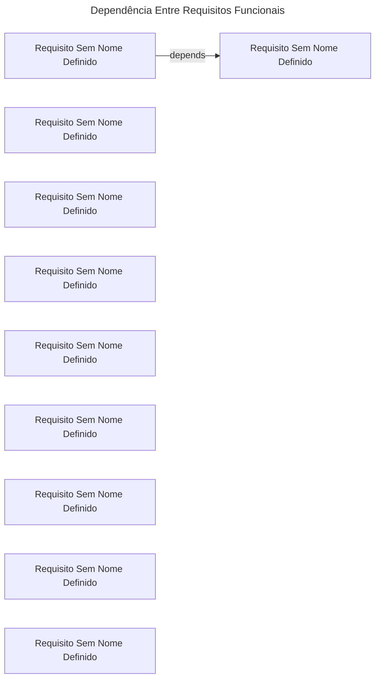

# Requisitos Funcionais

Tabela 1: Requisitos Funcionais do Módulo

|ID|Nome|Descrição|Dependências|Prioridade|
|-|-|-|-|-|
|RF01|Requisito Sem Nome Definido|O sistema deve permitir que usuários se cadastrem com nome, email e senha||Alta|
|RF02|Requisito Sem Nome Definido|O sistema deve permitir autenticação dos usuários|RF01|Alta|
|RF03|Requisito Sem Nome Definido|O sistema deve permitir que o usuário crie novas tarefas||Alta|
|RF04|Requisito Sem Nome Definido|O sistema deve permitir que o usuário edite tarefas existentes||Alta|
|RF05|Requisito Sem Nome Definido|O sistema deve permitir que o usuário exclua tarefas||Alta|
|RF06|Requisito Sem Nome Definido|O sistema deve listar as tarefas do usuário||Alta|
|RF07|Requisito Sem Nome Definido|O sistema deve permitir alterar o status das tarefas||Alta|
|RF08|Requisito Sem Nome Definido|O sistema deve permitir que o usuário crie e gerencie categorias||Média|
|RF09|Requisito Sem Nome Definido|O sistema deve permitir filtrar tarefas por status, data e categoria||Média|
|RF10|Requisito Sem Nome Definido|O sistema pode enviar notificações sobre tarefas pendentes ou próximas do vencimento||Baixa|

Autor: Autoria Própria

# Requisitos Não Funcionais

Tabela 2: Requisitos Não Funcionais do Módulo

|ID|Nome|Descrição|Dependências|Prioridade|
|-|-|-|-|-|
|RNF01|Requisito Sem Nome Definido|O sistema deve ter autenticação segura com criptografia de senha|RF02|Alta|
|RNF02|Requisito Sem Nome Definido|Deve ser uma aplicação responsiva, funcionando bem em desktop e mobile||Alta|
|RNF03|Requisito Sem Nome Definido|O backend deve ser desenvolvido em Django||Alta|
|RNF04|Requisito Sem Nome Definido|O frontend deve ser desenvolvido em React||Alta|
|RNF05|Requisito Sem Nome Definido|O sistema deve suportar pelo menos 100 usuários simultâneos||Média|
|RNF06|Requisito Sem Nome Definido|O tempo de resposta das requisições não deve exceder 2 segundos em 95% dos casos||Alta|

Autor: Autoria Própria

# Regras de Negócio

Tabela 3: Regras de Negócio do Módulo

|ID|Nome|Descrição|Dependências|Prioridade|
|-|-|-|-|-|

Autor: Autoria Própria

# Grafo de Dependências

Grafo de Fluxo 1: Grafo esquematizado das dependências entre os requisitos funcionais

Fonte: Autoria Própria

# Cadastro: Cadastro e Autenticação
Descrição: Usuário se cadastra e faz login
_Nenhum evento registrado._

# GerenciamentoTarefas: Gerenciamento de Tarefas
Descrição: Usuário cria, edita, exclui e altera status das tarefas
_Nenhum evento registrado._

# OrganizacaoTarefas: Organização de Tarefas
Descrição: Usuário organiza tarefas por categoria, data e status
_Nenhum evento registrado._

# Notificacoes: Notificações
Descrição: Sistema envia lembretes ao usuário
_Nenhum evento registrado._

# Matriz de Dependência de eventos

Tabela 4: Matrix de Dependência de Eventos

|Evento|Descrição|Dependência|Habilitados|Atores|
|-|-|-|-|-|

Autor: Autoria Própria

Grafo de Fluxo 4: 

Fonte: Autoria Própria

